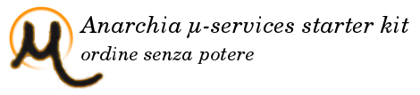

Anarchia µ-services starter kit
A starter-kit to build up your own working envirenment microservices oriented. Based upon standard and reliable open source framework like coreos, docker, spring cloud e Netflix oss. 

Please note that actually we can provide only italian documentations: sorry...

## Introduction and getting started
[Presentazione](https://docs.google.com/document/d/1t65BOeMm8bvuv1JL6yM_e-sh-5asB6tcLu-eofrZkY0/pub)

## Setup
[Installazione](https://docs.google.com/document/d/1Z0a-GuHVBIQTFozND7ecWjJ1RNxAWF9AyR290aqp95g/pub)

## Developer Guide
[Sviluupo](https://docs.google.com/document/d/1T-UOS4eLUvqwHU9p-ZJdSiYpYWxFS9kXPlNp138Yzgo/pub)

## System Guide
[Ambiente](https://docs.google.com/document/d/1EUSbRcBcRpFdiMNJoifA3l_KzLvZVoMz9aOmvCIoQWE/pub)

